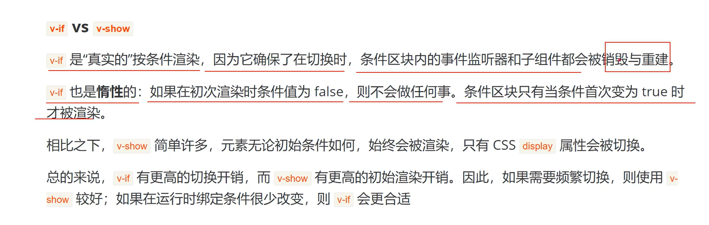
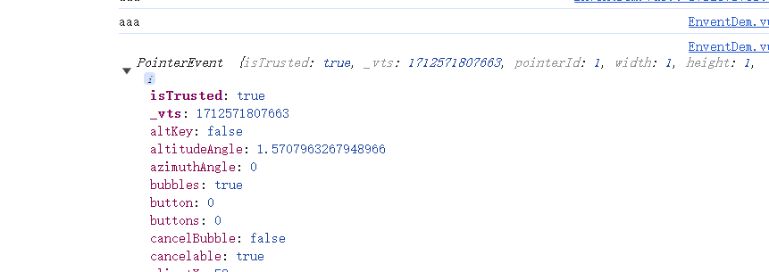
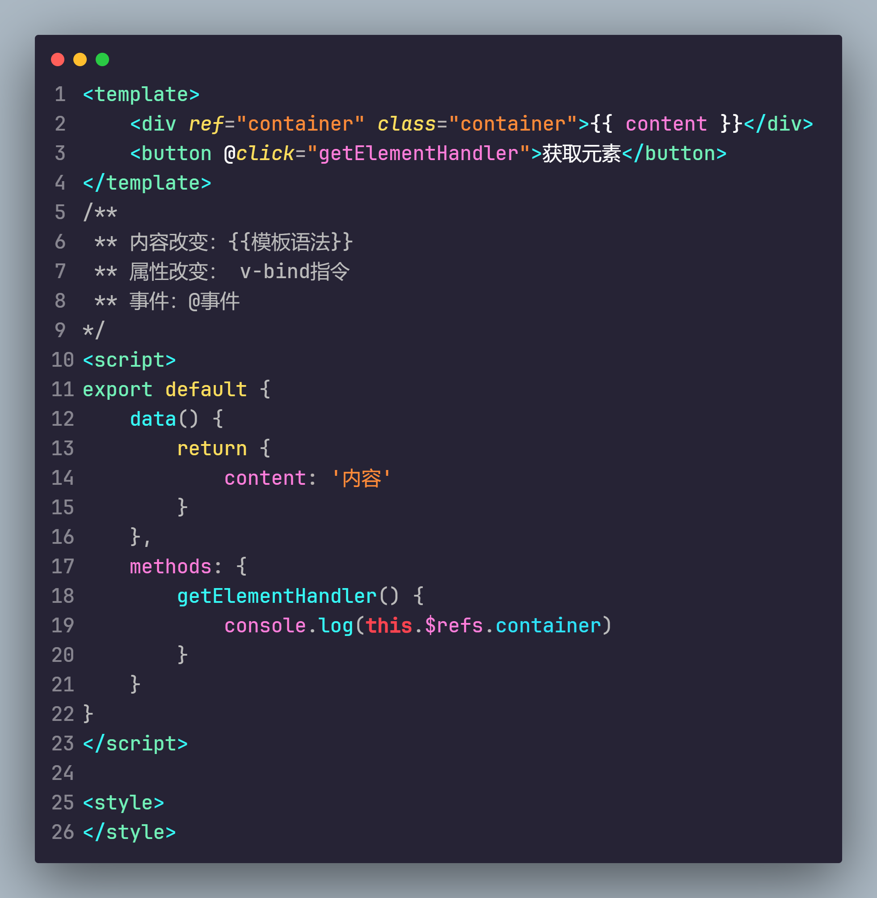
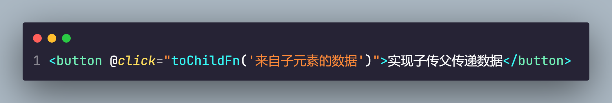
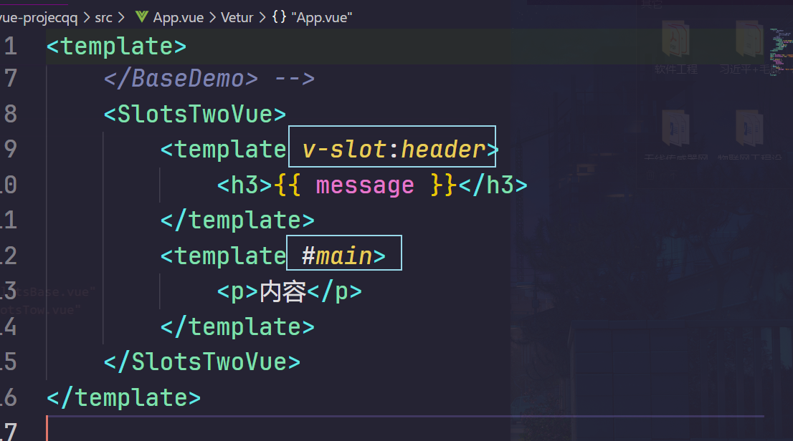

# VUE

## 简介

+ Vue是一个框架，也是一个生态，其功能覆盖了大部分前端开发常见的需求。

  

+ Vue2是选项式API，Vue3是组合式API

+ 命令行

  + cd：进入盘符
  + dir：查看当前目录下的文件
  + md：创建目录
  + rd：删除目录
  + cls：清除屏幕
  + ping：用来测试网络是否畅通

## 使用

+ 创建Vue项目

  `npm init vue@latest`

  

  + Project name：项目名（注意不能含大写字母）

    Add TypeScript：添加TS语法，默认no

    Add JSX Support：添加JSX支持，是ract里的，默认no

    Add Vue Router for Single Page Application development：添加路由

    Add Pinia for state management：添加状态管理

     Add Vitest for Unit Testing：测试文件

    Add an End-to-End Testing Solution：测试文件

    Add ESLint for code quality

    Add Vue DevTools 7 extension for debugging? (experimental)

+ 开启：

  进入项目目录：`cd 目录名`

  下载所需依赖：`npm install`(cnpm也可以，会比较快)

  执行：`npm run dev`

## 项目的目录结构

```shell
.vs code        --- VSCode工具的配置文件
node_modules	--- Vue项目运行的依赖文件（npm install 创建的）
public			--- 资源文件夹（浏览器图标）
src				--- 源码文件夹
.gitignore		--- git忽略文件
index.html		--- HTML的入口文件，所有代码将在这里运行
package.json	--- 信息描述文件（版本信息、版本依赖等）
README.md		--- 注释文件
vite.config.js	--- vue配置文件
```

src文件夹下：

```shell
assets			--- 资源文件夹，可以放置公共CSS和图片等
main.js			--- 配置文件，可以导入资源文件
```


## 模板语法

+ Vue使用一种基于HTML的模板语法，使我们能声明式地将其组件示例的数据绑定到呈现的DOM上

### 文本插值

在template里使用{{}}调用，在script里使用export default{data( ){ return{ 这里写对象，key:value形式

}}}

```vue
<template>
  <div>
    <h3>模板语法</h3><br>
    <p>{{ msg }}</p>
  </div>
  
</template>
<script>
export default {
  data() {
    return {
      msg:"hello"
    }
  }
}
</script>
```

### 使用JS表达式

+ 每个绑定仅支持单一表达式（单行，如if-else不可以），也就是一段能够被求值（即有结果的）的Javascript代码。一个简单的判断就是是否能直接写在return后面
+ 建议逻辑语法不放在模板里，直接在script里进行逻辑求值返回即可

### 原始HTML

+ {{}}会将数据插值为纯文本，而不是HTML。如想插入HTML，需要使用v-html指令

  ```vue
  <template>
    <div>
      <h3>模板语法</h3><br>
      <p v-html="rehtml"></p>
    </div>
    
  </template>
  <script>
  export default {
    data() {
      return {
        rehtml:"<a href='www.baidu.com'>百度</a>",
      }
    }
  }
  </script>
  ```

### 属性绑定

+ {{}}是不能在HTML的属性里使用的，要想绑定属性，需要使用v-bind：要绑定的属性。如果绑定的值是null或者undefined，则该属性会被移除

+ 可以选择简写方式，将v-bind移除，只写：

  ```vue
  <script>
  export default {
      data() {
          return {
              apId: "apId",
              myclass:"myclass"
          }
      },
  }
  </script>
  <template>
      <p v-bind:id="apId" :class="myclass">测试绑定</p>
  </template>
  ```

  

#### 动态绑定多个值

+ 如果需要绑定的多个属性值，可以使用 name{ key1:value1,key2:value2 }，在要绑定的元素上添加 v-bind=“name”

  ```vue
  <script>
  export default {
      data() {
          return {
              boji: {
                  apId: "apId", //自定义属性
                  myclass: "myClass",
              }
          }
      },
  }
  </script>
  <template>
      <p v-bind="boji">测试绑定</p>
  </template>
  ```

  

  还可以设置成id和class

  

### 条件渲染

#### v-if

+ v-if只有在条件为真的时候才会渲染，假的时候不渲染

#### v-else

+ 可以与v-if联合使用，当if为true是，else不渲染，当if为false时，else渲染

  ```vue
  <script>
  export default {
      data() {
          return {
              flag:false,
          }
      },
  }
  </script>
  <template>
      <p v-if="flag">测试if</p>
      <p v-else>测试else</p>
  </template>
  ```

  

#### v-else-if

+ 相当于Java中的else-if，可以多条件判断

  ```vue
  <script>
  export default {
      data() {
          return {
              type:"B"
          }
      },
  }
  </script>
  <template>
      <p v-if="type=='A'">A</p>
      <p v-else-if="type=='B'">B</p>
      <p v-else-if="type=='C'">C</p>
      <p v-else>not A/B/C</p>
  </template>
  ```

  

#### v-show

+ 类似v-if，为true时显示，为false时不显示

+ v-if与v-show区别：

  v-show无论如何都会渲染（存在），只是是否显示的问题（即display：none/block）；而v-if是移除创建元素，只有当为true时才渲染

  频繁切换适合v-show，条件很少改变适合v-if

  

### 列表渲染

+ 使用v-for指令对于data里的多个数据进行展示

+ `v-for="iteamName in arry"`使用{{iteamName }}调用显示，可以将in改成of，作用相同

  ```vue
  <template>
    <h3>列表渲染</h3>
    <p v-for="item in names">{{ item }}</p>
    <h3>复杂数据渲染</h3>
    <p v-for="item in result" :id="item.id">{{ item.id }}:{{ item.title }}</p>
  </template> 
  
  <script>
  export default {
      data() {
          return {
              names: ["a", "b", "c", "d", "e"],
              result: [{
                  "id": 123456,
                  "title": "a",
                  "avator": "a"
              },
                  {
                  "id": 123,
                  "title": "b",
                  "avator": "b"
                  },
                  {
                  "id": 777,
                  "title": "c",
                  "avator": "c"
              }
              ]
          }
      },
  }
  </script>
  
  <style>
  
  </style>
  ```

  

+ v-for 还可以使用两个参数，其中第二个参数为下标索引 `v-for="(item,index) in arrys"`

+ v-for 还可以使用三个参数，分别为value、key和index `v-for=(value,key,index) of obj`，可以来遍历对象的所有属性

  ```vue
  <template>
    <p v-for="(value,key,index) of userInfo">{{ value }}-{{ key }}-{{ index }}</p>
  </template> 
  
  <script>
  export default {
      data() {
          return {
              userInfo: {
                  name: "aaa",
                  age: 20,
                  sex:"man"
              }
          }
      },
  }
  </script>
  ```

  

#### 通过key渲染

+ vue默认按照就地更新的策略来更新通过v-for渲染的元素。当渲染的元素顺序发生改变时，默认会重写渲染，而非更换顺序。因此，为例重用和重新排序现有元素，需要为每个元素对应的块提供一个唯一的key，可以节省内存消耗

+ key要用该元素的唯一索引，一般不推荐使用index，因为会产生索引变化的情况，推荐使用id，建议给每个v-for都添加key

  ```vue
  <template>
    <h3>key属性添加到v-for</h3>
    <p v-for="(item,index) of names" :key="index">{{ item }}</p>
    <p v-for="item in result" :id="item.id" :key="item.id">{{ item.id }}:{{ item.title }}</p>
  </template> 
  
  <script>
  export default {
      data() {
          return {
              names: ["a", "b", "c", "d", "e"],
              result: [{
                  "id": 123456,
                  "title": "a",
                  "avator": "a"
              },
                  {
                  "id": 123,
                  "title": "b",
                  "avator": "b"
                  },
                  {
                  "id": 777,
                  "title": "c",
                  "avator": "c"
              }
              ]
  
          }
      },
  }
  </script>
  ```

  

### 事件处理

+ 我们可以用v-on指令（简写为@）来监听DOM事件，并在事件触发时执行对应的js，用法：`v-on:click="methodName" or @click="handler"`

+ 事件处理器的值可以是

  + 内联事件处理器：事件被触发时执行的内敛js语句（与onclick类似）
  + 方法事件处理器：一个指向组件上定义的方法的属性名或路径

  ```vue
  <template>
      <div>
          <h3>内联事件处理器</h3>
          <button @click="count++">add</button><br />
          <p>{{ count }}</p>
      </div>
      <br />
      <div>
          <h3>方法事件处理器</h3>
          <button @mouseover="addcount">add</button>
          <p>{{ count2 }}</p>
      </div>
  </template>
  
  <script>
  export default {
      data() {
          return {
              count: 0,
              count2: 0
          }
      },
      //所有的函数或方法都放在这里
      methods: {
          addcount() {
              this.count2 += 1
          }
      }
      //所有写在data里的对象或者值都可以用this获取
  }
  </script>
  
  <style>
  </style>
  ```

[^注意]: 所有的方法或者函数都要放在script里的method：{}里，在method里调用data里的对象或者方法，要使用this

#### 事件参数

+ 事件参数可以获取event对象或者通过事件传递数据

+ Vue中的event对象，就是原生js的event对象

+ 事件传参：

  ```vue
  <template>
      <div>
          <h2>事件传参</h2>
          <p @click="getNames(item)" v-for="(item, index) of names" key="index">
              {{ item }}
          </p>
      </div>
  </template>
  
  <script>
  export default {
      data() {
          return {
              names: ['aaa', 'bbb', 'ccc', 'ddd,']
          }
      },
      //所有的函数或方法都放在这里
      methods: {
          getNames(name) {
              console.log(name)
          }
      }
  }
  </script>
  
  <style>
  </style>
  ```

+ 传参时同时传递event对象：在第二个参数增加一个`$event`

  

  

  

### 事件修饰符

#### 阻止默认事件

1. 在方法中调用`事件.preventDefault()`

   

2. 在要阻止的事件后加默认修饰符`.prevent`

   

#### 阻止事件冒泡

+ 事件冒泡是触发子元素的事件时，父元素事件同时触发（例如：嵌套起来的点击事件）

+ 方法：

  1. 在子元素中调用`事件.stopPropagation()`

     

  2. 在子元素的事件后加默认修饰符 `.stop`

#### 一次事件

.once

#### 键盘事件

.enter

### 数组变化侦测

数组的一些方法有的会直接引起ui变化，有的并不会

#### 变更方法

+ 数组放生变化，ui会自动变化更新
+ 包括
  + push()
  + pop()
  + shift()
  + unshift()
  + splice()
  + sort()
  + reverse()

#### 数组替换

+ 进行数组替换，不会改变原数组，ui不会自动更新
+ 包括
  + concat()
  + filter()
  + slice()

### 计算属性

+ 如果模板中要实现复杂逻辑，需要使用计算属性

+ 使用computed：{在这里添加返回值即逻辑判断}

+ 类似method，区别为：

  计算属性只会在数值发生更改时才会重新计算，而方法每次调用都会重新计算

  

### class绑定

+ class的绑定做了增强，其中不止可以放置字符串，还可以放置对象或者数组

#### 绑定对象


#### 多个对象的绑定


#### 绑定数组和对象


> 数组和对象嵌套的过程中，只能是数组嵌套对象即[{}]，不能反

### style绑定

+ 主要用于内联样式的style绑定，方法与绑定class类似，也是通过`:style"{}"`


### 侦听器

+ 侦听的是data里的动态数据（响应式数据）的变化

+ 使用：在watch：{}里写，需要注意的是要监听的数据名要与watch里的名称完全一致

  

### 表单输入绑定

+ 使用v-model指令，可以实时获取到表单的值。可以实时更新data里的动态数据，可以用于做密码校验等

  

+ v-model的修饰符：

  + `.lazy`：延迟获取（并不会同时响应，只有失去焦点或者回车之类后才会获取到）
  + `.number`：只获取数字
  + `.trim`：去掉输入的前后空格

  

### 模板引用

+ 通过使用ref属性来直接设置要获取的dom元素名字

  使用`this.$refs.ref的名字`获取dom元素，之后可以使用该dom元素使用原生js的所有功能

  

## 组件组成

+ 组件最大的优势是可复用性，一般我们会将vue组件定义一个单独的vue文件中

+ 组件的组成结构：

  <template>这里承载所有标签HTML</template>
  <script>export default{这里书写所有的逻辑JS}</script><style>这里承载所有的样式CSS</style>

+ 引入组件：

  1. 引入：在script中使用`import name from "要引入的vue"`
  2. 注入：在`export default{ components:{ name:value }} `注意：name和value一致时可以省略value
  3. 显示：在template里以标签的形式显示组件 `<name/>`

  注意：在入口文件可以用`<script setup>`，这样可以省去上述第二部

+ `<style scoped>`：scoped可以让样式只在当前组件中生效

## 组件的嵌套关系


通过组件的相互引用，可以达到嵌套的目的

## 组件的注册方式

+ 一个vue组件在使用前要先被注册，这样vue才能在渲染模板时找到对应的模板并实现，组件注册有两种：全局注册和局部注册

### 局部注册

+ 只在某个组件内引用注入，该组件便只能在这个组件内使用

+ 使用方式：

  1. 引入：在script中使用`import name from "要引入的vue"`
  2. 注入：在`export default{ components:{ name:value }} `注意：name和value一致时可以省略value
  3. 显示：在template里以标签的形式显示组件 `<name/>`

  注意：在入口文件可以用`<script setup>`，这样可以省去上述第二部

  

### 全局注册

+ 全局注册在main.js注册，在任意的组件中都可以使用

+ 使用方式：

  1. 在main.js中的 createApp(App)与app.mount('#app')之间写组件的注册

     

  2. 引用：`import 组件名 from '组件位置'`

  3. 使用app.component("自己起的组件名",“引入的组件名”)

  4. 在要使用的组件中直接使用标签引用

  

  >缺点：即使组件没有用到，也会直接打包上传；可能会影响维护

## 组件传递数据

+ 组件之间传递数据的解决方案是`props`

+ 父级给子级传递数据：

  1. 在父级中引入子级，在子级的标签中加入`name="value"`
  2. 在子级中使用`props:["name"]`接收数据
  3. 在模板中使用{{name}}可以显示数据

  

  

### 动态数据传递

在Parent里的data设置参数，在标签里绑定该参数，其余方式一样

[^注意]: props传递数据只能从父级传递给子级，不能反传

### 组件传递多种数据类型

+ 通过props传递数据可以传递任何的值：数值型、字符串、数组、对象等等

### 组件传递props校验

+ 在child里的props使用type校验，如果数据类型不对会报错

  

  

#### 默认值校验

+ 使用`default`，当未传递时会使用默认值显示

+ 数字和字符串都可以直接用default直接设置默认值

  数组和对象必须通过工厂函数的方式设置默认值

  

#### 必选项

+ 设置必须传递的数值，使用`required:true`，如果未传会报警告

  

  

>注意：父元素的元素可以在函数中进行接收，使用this.name获取，但是props的数值是只读的，不可以对父元素的数值进行修改，否则会报错

### 组件事件

+ 在组件的模板表达式中，可以直接用`$emit`方法触发自定义事件，触发自定义事件的目的是组件之间传递数据，可以实现子传父

+ 使用：这里以点击按钮传递

  1. 在要传递的vue中添加按钮的点击事件，使用`this.$emit('自定义事件名称',传递的数据)`

     

     

  2. 在要接收的vue中引入传递的vue，在标签中使用@自定义名字设置接收后触发的函数，函数中可以带参来接收传递的数据

     

     

> 组件传递之间：父传子使用props，子传父使用自定义事件

### 组件事件配合v-model

结合使用v-model、watch以及$emit来达到两个组件之间，输入框输入数据同时令一个组件同时接收数据


### 组件数据传递

+ 通过props实现子传父（通过传递函数携带参数实现）

  

  

  

## 透传属性

+ 透传属性指传递给一个组件既不是props也不是emits等，是class、id等属性
+ 可以通过组件直接传递到根元素上
+ 注意：必须是唯一的根元素，否则不会渲染
+ 禁用属性继承：在export default里添加 `inheritAttrs:false`

## 插槽Slots

+ 要想为子组件传递一些模板片段（HTML结构），就需要`slot`标签

+ 使用方法：

  1. 在父组件的双标签内写入要传递的HTML结构

     

  2. 在子组件需要位置使用slot标签

     

     

### 渲染作用域

+ 插槽内容可以访问到父组件的数据作用域，即要想传递HTML中携带动态内容，需要在父组件中书写

  

  

### 插槽默认值

+ 如果没有传递数据，则会显示默认值，直接在slot标签内书写默认值即可

### 具名插槽

+ 有些时候会用到多个插槽渲染在不同的地方，不同的HTML结构对应不同插槽位置，为避免重复渲染，会用到具名插槽，要使用`v-slot:name`(在template里加)，`v-slot:name可以简写为#name`

  

  

### 插槽内数据使用

+ 有时会需要子组件在使用父组件传递过来的插槽数据的同时使用本身组件内的数据，可以通过像组件传参的方式传递给插槽。

+ 使用方法：将子元素数据通过`:name='value'`传递给父元素，父元素通过`v-slot="objName"`接收后再拼接通过`objName.name`slot传递

  

  

+ 如果是具名插槽，只需要在template使用`#name="objName"`，其他使用方式一样

  

  

## 组件的生命周期

+ 生命周期的每一个时期都有一个函数被称为钩子函数，这个函数不需要调用，在特定的周期会自动调用

+ 生命周期函数

    创建期:beforeCreate（创建前） create（创建）

    挂载期:beforeMount（渲染前） mounted（渲染）

    更新期:beforeUpdate（数据变化时更新前） updated（更新）

    销毁期:beforeUnmount（组件将要销毁时） unmounted（销毁）

  


### 生命周期的应用

+ 读取dom结构，需要在渲染后才能读取，也可以获取网络请求的数据，一般是在mounted时

  

  

## 动态组件

+ 有些场景需要在两个组件之间相互切换，需要使用`component`标签和`:is`指令。component 标签是 Vue 框架自定义的标签，它的用途就是可以动态绑定我们的组件，根据数据的不同更换不同的组件。而:is指令用于挂载不同的数据以切换内容

+ 使用：

  

  

## 组件保持存活

+ 当使用component 进行切换时，原组件会被卸载，使用`<keep-alive>`可以使切换掉的组件仍保持存活状态。可以保留原始在vue修改的数据等

  

  可以感受到，切换组件后的的原组件页面被更新的数据仍然保留

## 异步组件

+ 同步：ABC三个功能按顺序依次进行；异步：ABC三个项目同时进行

+ 异步可以使哪个功能用到了就加载哪个功能，而不是加载好所有功能，会让项目的加载更快

+ 使用方法：

  1. 引入defineAsyncComponent :`import { defineAsyncComponent } from 'vue'`

  2. 异步加载组件

     

## 依赖注入

+ 如果需要将祖先的数据传递给孙子的组件，使用props传递会很麻烦，这一问题叫做props的逐级透传，可以使用`provide`和`inject`解决

+ 使用方式：

  1. 在祖先里使用provide传递数据

     

  2. 在要接受的子组件中使用inject接收

     

  > 提示：provide和inject只能由上到下传递，而不能反传；且可以在最根目录（main.js）提供数据，这样在所有文件中都可以读取

  

## vue应用

+ 应用实例：每一个Vue的应用都是通过`createApp`函数创建一个新的应用实例（一般是在main.js里）

+ 根组件：我们传入`createApp`的对象实际上是一个组件，每一个应用都需要一个根组件，其他的组件都要从这个根组件开始，作为这个根组件的子组件，一层一层引用执行

+ 挂载应用：应用实例必须在调用挂载`.mount()`之后才会渲染出来。该方法接收一个”容器“参数，可以是一个实际的DOM元素或是一个CSS选择器字符串

  

  > 此处这个#app是id选择器，指的是index.html中的id，因此以后项目中的所有内容都会在这个里面呈现

  

+ 浏览器可执行文件：HTML、CSS、JavaScript、image。vue文件不能直接被浏览器执行，会通过构建工具将所有vue文件打包解析成js文件，然后运行
+ 公共资源：`src`目录下的`assets`文件夹存放的是公共资源，类似公共css、图片等

## 路由

+ 使用npm install vue-router 下载路由

+ 可以在src文件夹下创建一个view文件夹，里面存放的是单页面，而components里放置的是共用页面

+ 使用方式：

  1. 在src下创建router文件夹，文件夹里创建index.js或者router.js

  ```js
  import { createRouter, createWebHistory } from 'vue-router'
  //导入所需界面方式1
  import LoginVue from '../views/Login.vue'
  //创建路由
  const router = createRouter({
    history: createWebHistory(import.meta.env.BASE_URL),
      //这个routes可以单独拿出去
    routes: [
        {
          path:'/',
          redirect:'/name'  //可以使用redirect显示默认界面
        },
      {
        path: '/',  //访问路径
        name: 'login',//名称
        component: LoginVue  //引用组件
      },
      {
        path: '/register',
        name: 'register',
        // route level code-splitting
        // this generates a separate chunk (About.[hash].js) for this route
        // which is lazy-loaded when the route is visited.
        component: () => import('../views/Register.vue') //引用方式2
      }
    ]
  })
  //导出
  export default router
  
  ```

  2. 在main.js里导入router.js

     


## Axois(异步)

+ 这不是一种新技术，本质上还是对原生XMLHttpRequest的封装，可用于浏览器和nodejs的HTTP客户端，只不过它是基于Promise的，符合最新的ES规范。具备以下特点：

  在浏览器中创建XMLHttpRequest请求
  在node.js中发送http请求
  支持Promise API
  拦截请求和响应
  转换请求和响应数据
  取消要求
  自动转换JSON数据
  客户端支持防止CSRF/XSRF(跨域请求伪造)

+ 使用方法：

  1. 下载axios所需依赖框架：`npm install axios vue-axios --save`

  2. 在vue项目的`main.js`文件中引入`axios`

     ```js
     import { createApp } from 'vue'
     import App from './App.vue'
     import router from './router'
     import VueAxios from 'vue-axios'
     import axios from 'axios'
     
     const app = createApp(App)
     app.use(VueAxios,axios)
     app.use(router)
     app.mount('#app')
     ```

  3. 解决跨域问题：

     在src下创建api文件夹，再创建axios.js，配置全局访问设置：

     ```js
     import axios from "axios";
     const api = axios.create(
     	{ 
        // axios中请求配置有baseURL选项，表示请求URL公共部分
       // baseURL: 'http://127.0.0.1:8888/ruoyi',
     		baseURL: '/api', //全局配置api接口
     		timeout: 1000 
     	}
     );
     export default api;
     
     ```

     在src下的vue.config.js配置代理：

     ```js
     server: {
         // 自动打开浏览器
         proxy: {
           // // detail: https://cli.vuejs.org/config/#devserver-proxy
           '/api': {
             target: `http://localhost:8888/ruoyi`,//设置后台访问地址,此后/api可以代替这个地址
             changeOrigin: true,
             pathRewrite: {
               '^/api': ''
             }
           }
         }
       }
     ```

     > 注意：还可以选择在后端的Controller里添加 @CrossOrigin注解来解决跨域

  4. 使用：

     ```vue
     <script>
     //下载qs插件，以转化post传递的数据，不转化后台接收值为null
     import qs from 'qs'
     export default {
         data() {
             return {
                 admin: {
                     uname: '',
                     uPwd: '',
                 }
             }
         },
         methods: {
             adminLoginSubmit(e) {
                 e.preventDefault();
                 //路径
                 this.axios.post('api/login/adminLogin.do', qs.stringify(this.admin)).then((result) => { //这里必须使用qs转化数据
                     if (result.data === "登录成功") {
                         this.$router.push('main');
                     } else {
                         alert(result.data)
                     }
                 }).catch((err) => { //失败
     
                 });
             }
         }
     }
     </script>
     ```

​	或者：

```vue
// 在 node.js 用GET请求获取远程图片
axios({
  method: 'get',
  url: 'http://bit.ly/2mTM3nY',
  params:{  //post请求这里使用data:

}
})
  .then(function (response) {
	//返回处理
)
  });


 axios
    .post(
      '/api/ahzoo',
      qs.stringify({
        id: 999,
        name: 'ahzoo'
      })
    )
    .then(function (response) {
      console.log(response);
    })
    .catch(function (error) {
      console.log(error);

    });
```

### axios前后端通讯

#### Get请求

+ 默认数据类型为 application/json

##### 有参数时

vue：

```js
axios({
  method: 'get',
  url: '',
  params:{  //post请求这里使用data:

}
})
  .then(function (response) {
	//返回处理
)
  });
//或者
axios.get(`url?param1=${param1}`).then((result) => {
    
}).catch((err) => {
        
});
```

javaSpringboot：正常接收


##### 无参数时

+ 将参数部分去掉即可

#### Post请求

| 方法 | 内容类型（Content-Type）          | 编码方式        |
| :--- | :-------------------------------- | :-------------- |
| POST | application/json                  | Request Payload |
| POST | application/x-www-form-urlencoded | Form Data       |
| POST | multipart/form-data               | Form Data       |

**application/json格式时**

Vue部分：

```js
 axios.post('url', {
      param1: 'value1',
      param2: 'value2',
})
.then((result) => {
    
}).catch((err) => {
        
});
```

Springboot

+ 参数添加@RequestBody注解：@RequestBody主要用来接收前端传递给后端的json字符串中的数据的(请求体中的数据的)；而最常用的使用请求体传参的无疑是POST请求了，所以使用@RequestBody接收数据时，一般都用POST方式进行提交。在后端的同一个接收方法里，@RequestBody与@RequestParam()可以同时使用，@RequestBody最多只能有一个，而@RequestParam()可以有多个。

  > 需要注意的是，有时候不添加也可以。
  >
  > 注：如果参数前写了@RequestParam(xxx)，那么前端必须有对应的xxx名字才行(不管其是否有值，当然可以通 过设置该注解的required属性来调节是否必须传)，如果没有xxx名的话，那么请求会出错，报400。
  >
  > 注：如果参数前不写@RequestParam(xxx)的话，那么就前端可以有可以没有对应的xxx名字才行，如果有xxx名的话，那么就会自动匹配；没有的话，请求也能正确发送。

  

  

**multipart/form-data格式时**

+ 一般来说常常在需要发送文件，或者需要发送文件加文本的时候我们才会使用multipart/form-data格式来发送， 多用于文件上传，用于POST请求。此时数据的处理就需要使用FormData( )
+ 注意，header要设置为multipart/form-data

Vue部分：

```js
let formData = new FormData();
formData.append('id', 999);
formData.append('name', 'value');
axios.post('url', formData)
.then(function (response) {
  console.log(response);
})
.catch(function (error) {
  console.log(error);
});
```

SpringBoot部分：


**multipart/form-data格式时**

vue部分

```js
//处理方式1，使用URLSearchParams
let param = new URLSearchParams();
param.append('id', 999);
param.append('name', 'ahzoo');
axios.post('/api/ahzoo', param)
.then(function (response) {
  console.log(response);
})
.catch(function (error) {
  console.log(error);
});

//处理方式2，使用QS
 axios.post('/api/ahzoo',qs.stringify({
    id: 999,
    name: 'ahzoo'
  })
)
.then(function (response) {
  console.log(response);
})
.catch(function (error) {
  console.log(error);

});
```

> qs是查询字符串解析和将对象序列化的库，qs的两个主要使用方法：
>
> - `qs.stringify()`：将对象序列化成url的形式，以`&`进行拼接
> - `qs.parse()`：将url解析成对象形式

SpringBoot部分：同上理

#### Put请求

+ 常用于更新数据，传递参数方式与Post请求一致

#### Delete请求

+ 常用于更新数据，传递参数方式与Get请求一致

## sessionstorage 

+ vue中的sessionstorage与session功能类似，用于保存一些用户状态

# ElementUi

## 介绍

### 定义

+ element ui是一个网站快速成型工具和桌面端的组件

+ 是一个基于vue的ui框架，该框架提供了各种vue相关组件，方便我们快速开发页面

### 由来

+ 饿了么前端团队，基于vue进行开发并进行的开源，elementUi提供的都是封装好的组件

## 使用

### 安装

使用npm：`npm i element-ui -s`  这个是vue2

`$ npm install element-plus --save` 这个是vue3

### 直接使用脚手架创建项目

`vue-cli@3 init webpack projectName`

## 组件

### 按钮

#### 一些分类

```vue
<div class="mb-4">
    <el-button>Default</el-button>
    <el-button type="primary">Primary</el-button>
    <el-button type="success">Success</el-button>
    <el-button type="info">Info</el-button>
    <el-button type="warning">Warning</el-button>
    <el-button type="danger">Danger</el-button>
  </div>
```

#### 样式

只需在所需按钮上添加以下对应属性即可

##### 改变形状：

+ plain：朴素按钮
+ round：圆角
+ circle：圆
+ disabled：禁用
+ loading：加载中

##### 改变大小：

添加`size=""`属性，其中large是大的，small是小 

### 图标

图标的使用要先导入element库中的所有图标并注册，否则无法使用
